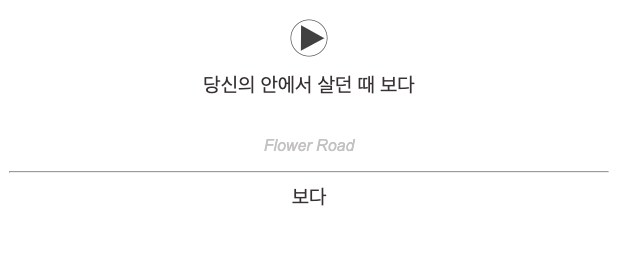
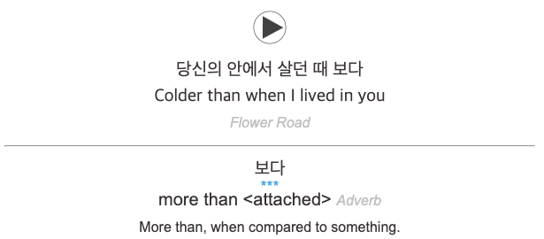
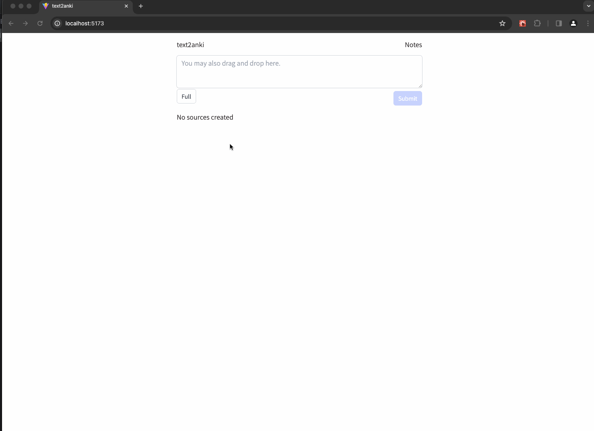

# text2anki

Create Korean language learning Anki Flashcards from text and other sources.

## Features

- Create sources from:
  - Text input
  - Text files
  - Instagram URLs
  - (video and subtitles in the future)
- Takes existing text translations or uses
  [Papago API](https://api.ncloud-docs.com/docs/en/ai-naver-papagonmt) to generate translations

- Keyboard navigation to create cards:
  - With tokenized text from [Khaii](https://github.com/kakao/khaiii) (recommended) or [Komoran](https://github.com/shineware/KOMORAN)
  - With a dictionary of a local copy of the
    [National Institute of Korean Language's Dictionary](https://krdict.korean.go.kr/) (recommended)
    or it's [open API](https://krdict.korean.go.kr/openApi/openApiInfo)
  - Text to Speech using the [Azure API](https://learn.microsoft.com/en-us/azure/ai-services/speech-service/rest-speech-to-text)

- Easily reconfigurable with interfaces and configurations

## Preview

Card Front

Card Back

Demo with [Sample Output](docs/text2anki-018ec0ea-3739-76f1-be97-04d424bf6476.zip)

## Internal Packages

Some internal packages can be re-used for other projects:

- [firm](pkg/firm) - a customizable declarative validation package with no struct tags
- [jhttp](pkg/util/jhttp) - abstracts `http.HandlerFunc` by returning errors, in standard golang fashion, by assuming json responses
  - Also includes [reqtx](pkg/util/jhttp/reqtx), which isolates each request to a database transaction
- Many other packages in [util](pkg/util) that can be used for other web apps